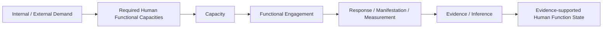

# Unified Ontology of Human Function (UOHF)

## A governed semantic and computational ontology for human function

[中文](README.zh-CN.md) · [Definition 2.1](https://doi.org/10.5281/zenodo.21630406) · **[18 Core + 104 Specific Capacities](papers/capacity-system/README.md)** · [Formal framework](papers/formal-framework/README.md) · [Unification](papers/unification/README.md) · [Papers](papers/README.md) · [Version archive](versions/README.md) · [Publication map](PUBLICATIONS.json) · [Ontology release status](ontology/README.md) · [Rights and reuse](RIGHTS_AND_REUSE.md) · [Collaboration](COLLABORATION.md) · **[Downstream HFWM repository](https://github.com/dlehche/Human-Function-World-Model)**

**Official name:** Unified Ontology of Human Function  
**Official abbreviation:** UOHF  
**Current authoritative framework:** UOHF Definition 2.1  
**Current authoritative publication revision:** 2.1.1  
**Author:** Lei Che  
**Affiliation:** MoveTips Technology (Beijing) Co., Ltd.  
**Correspondence:** dlehche@gmail.com  
**Authoritative framework DOI:** [10.5281/zenodo.21630406](https://doi.org/10.5281/zenodo.21630406)  
**Repository/publication licensing:** see each publication record; current UOHF publications use CC BY-NC 4.0

> **Human function is the body's capacity to be appropriately engaged to meet internal and external demands.**

> **人体功能，就是身体被正常调用的能力。**

---

## Repository role

This repository is the canonical public home for the **semantic and ontology layer of human function**.

UOHF governs:

- the root definition and scope of human function;
- Demand, capacity, functional engagement, evidence and related semantic distinctions;
- ontology identities, type boundaries and governed relations;
- the public human-function capacity coordinate;
- formal human-function semantics and computational constraints;
- UOHF version history, citation metadata and public ontology-release boundaries.

UOHF is **not** the canonical repository for the Human Function World Model itself. HFWM uses UOHF as its semantic foundation and is maintained in the dedicated [Human-Function-World-Model repository](https://github.com/dlehche/Human-Function-World-Model).

---

## Current authoritative framework

### UOHF Definition 2.1

UOHF Definition 2.1 is the current authoritative overall framework. It restores the full internal-and-external-demand scope and distinguishes the body-dependent capacity of human function from the processes, observations, inferences, states and actions used to represent or affect it.

- Zenodo: [10.5281/zenodo.21630406](https://doi.org/10.5281/zenodo.21630406)
- Publication revision: **2.1.1**
- License: **CC BY-NC 4.0**
- Chinese framework text: [UOHF_DEFINITION_ZH.md](UOHF_DEFINITION_ZH.md)

---

## Human Function Capacity System Version 1.0

### 18 core human functional capacities + 104 specific human functional capacities

The Version 1.0 capacity-system publication makes the UOHF human-function capacity catalogue a public, citable and versioned scientific object. It defines **18 core capacities and 104 specific capacities**, each at the whole-person level and with traceable scientific or professional source support.

- [Publication overview](papers/capacity-system/README.md)
- [Complete English paper](papers/capacity-system/source/en/README.md)
- [中文完整论文](papers/capacity-system/source/zh/README.md)
- Zenodo: [10.5281/zenodo.21975100](https://doi.org/10.5281/zenodo.21975100)
- License: **CC BY-NC 4.0**

The public catalogue is a versioned semantic coordinate set, not a claim of permanent exhaustiveness and not a 104-dimensional interchangeable score vector. The formal fine-grained ontology types remain `SUBCAPACITY` and `CAPACITY_COMPONENT` under their respective `CORE_CAPACITY`.

---

## Current focused UOHF publications

### A Formal Framework for Human Function in UOHF

**Capacity, Functional Engagement, Demand-Bounded Realizability, and Evidence-Constrained Decision Support**

- Zenodo: [10.5281/zenodo.21721599](https://doi.org/10.5281/zenodo.21721599)
- [Complete English paper](papers/formal-framework/UOHF_Formal_Framework_EN_V1.0.md)
- [中文完整论文](papers/formal-framework/UOHF_Formal_Framework_ZH_V1.0.md)
- [Overview](papers/formal-framework/README.md)

### Unification in the Unified Ontology of Human Function

**A Whole-Person Conceptual Framework Centered on Human Function and Functional Engagement**

- Zenodo: [10.5281/zenodo.21635694](https://doi.org/10.5281/zenodo.21635694)
- [English complete-text index](papers/unification/UOHF_Unification_EN_V1.0.2.md)
- [中文完整全文索引](papers/unification/UOHF_Unification_ZH_V1.0.2.md)
- [Overview](papers/unification/README.md)

---

## Downstream HFWM research program

The **Human Function World Model (HFWM)** is a downstream world-model and model-coordination research program built on the UOHF semantic foundation. Its source texts, architecture, model-interoperability work, Functional Bridge research and HFWM-specific governance are maintained in a separate canonical repository:

**HFWM repository:** https://github.com/dlehche/Human-Function-World-Model

Current HFWM publications include:

- *The Human Function World Model: Modeling the Whole Person Through Human Function Across Tasks, States, Actions, and Longitudinal Change* — DOI: [10.5281/zenodo.22685308](https://doi.org/10.5281/zenodo.22685308)
- *Connecting Human Models Through Human Function: Toward a Common Computational Protocol for Whole-Person Modeling* — DOI: [10.5281/zenodo.23180973](https://doi.org/10.5281/zenodo.23180973)

These are related downstream publications, not members of the UOHF publication/version sequence.

---

## What problem does UOHF solve?

Human knowledge about disease, anatomy, physiology, rehabilitation, movement, cognition, behavior and health is extensive, but those descriptions do not automatically share one semantic account of human function.

UOHF provides governed semantics for asking:

- What internal or external Demand is present?
- Which human functional capacities are relevant?
- What is the difference between a capacity and its actual engagement?
- What was observed, measured, reported or inferred?
- What evidence supports a judgment, and what remains unknown?
- Which relations are general knowledge and which are person-specific facts?
- How should versioning, provenance, authority and semantic change be governed?

The objective is not to replace domain expertise. It is to make human-function semantics **explicit, computable, constrained, traceable, auditable and revisable**.

---

## Core semantic architecture

The diagram is an organizing semantic view, not a universal causal equation.

---

## Start here

| Resource | Purpose |
|---|---|
| [UOHF Definition 2.1](https://doi.org/10.5281/zenodo.21630406) | Current authoritative overall framework |
| [Human Function Capacity System V1.0](papers/capacity-system/README.md) | 18 core + 104 specific capacity catalogue |
| [Formal framework](papers/formal-framework/README.md) | Mathematical and computational formalization |
| [Unification paper](papers/unification/README.md) | Whole-person conceptual unification |
| [Papers index](papers/README.md) | UOHF focused publications |
| [Version archive](versions/README.md) | UOHF public framework and focused-publication history |
| [Publication map](PUBLICATIONS.json) | Machine-readable UOHF publication metadata |
| [Ontology release status](ontology/README.md) | Current public machine-readable ontology boundary |
| [HFWM repository](https://github.com/dlehche/Human-Function-World-Model) | Downstream world-model and model-interoperability research |

---

## Current implementation and claim boundary

The governed implementation supports concept domains, stable identifiers, typed relations, relation contracts, evidence structures, authority constraints, lifecycle governance, task-centered state convergence, action semantics, execution feedback, reassessment and longitudinal monitoring.

This infrastructure-level statement does **not** mean that all 104 fine-grained Version 1.0 capacity objects already have complete production lifecycle activation, task/structure/assessment/intervention endpoint coverage or Runtime release. Catalogue publication and production release are governed separately.

The complete production ontology, relation topology, implementation rules and operational data assets are not reproduced in full in this public repository.

---

## Citation

> Che, Lei. *UOHF Definition 2.1: Unified Ontology of Human Function*. Version 2.1.1. MoveTips Technology (Beijing) Co., Ltd., 2026. DOI: [10.5281/zenodo.21630406](https://doi.org/10.5281/zenodo.21630406).

Paper-specific citation metadata is maintained in each UOHF paper directory. Repository-level citation metadata remains in [CITATION.cff](CITATION.cff).

---

## Copyright and reuse

**Copyright © 2026 Lei Che and MoveTips Technology (Beijing) Co., Ltd.**

Current UOHF publications are identified as **CC BY-NC 4.0**. Academic citation and non-commercial reuse are permitted subject to the applicable license terms. Commercial use of copyright-protected publication content requires separate permission where copyright permission is required. See [RIGHTS_AND_REUSE.md](RIGHTS_AND_REUSE.md).
